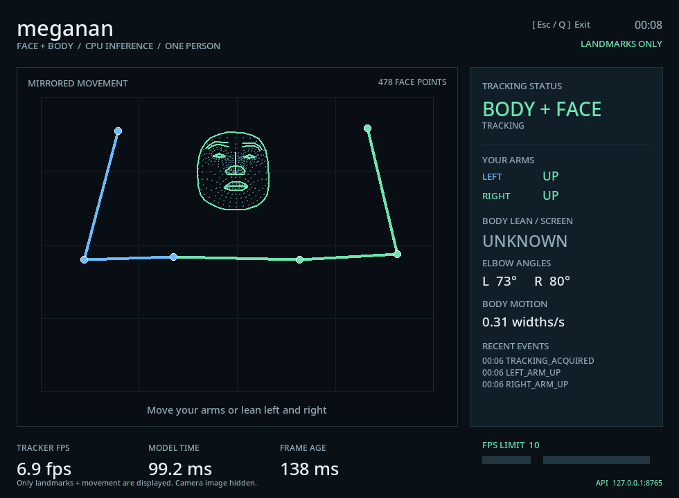

# meganan

**웹캠에서 사람의 움직임을 추적하고, 영상 대신 좌표와 움직임을 GUI와 API로 전달하는 로컬 CPU 프로그램입니다.** 얼굴만 보이는 상황에서도 얼굴의 위치와 움직임을 추적합니다. 특정 사람이 누구인지 식별하는 얼굴 인식 기능은 없습니다.



*노트북의 실제 V4L2 카메라와 CPU로 실행한 GUI입니다. 카메라 사진 대신 추론한 얼굴·몸의 점과 선, 움직임 수치만 표시합니다. 화면의 FPS는 촬영 순간의 값이며 모든 환경에서 보장하는 성능이 아닙니다.*

- 한 사람의 몸 관절 17개와 얼굴 랜드마크 478개를 추적합니다.
- GUI의 슬라이더로 추적 FPS 상한을 1–30 사이에서 조절합니다.
- 같은 움직임 데이터를 HTTP JSON과 SSE 스트림으로 읽을 수 있습니다.
- 기본 엔진은 C++17이며, 추론은 CPU에서 실행합니다. 비교·검증용 Python 엔진도 포함합니다.
- 모델은 저장소에 포함되어 있어, 의존성 설치 후 일반 실행에는 인터넷 연결이 필요하지 않습니다.

현재 배포 형태는 **소스를 받아 실행하는 Linux 데스크톱 프로그램과 로컬 API 서비스**입니다. 다른 프로그램에서는 HTTP/SSE를 통해 재사용할 수 있습니다. PyPI 패키지로 배포한 프로젝트가 아니므로 `pip install meganan`으로 설치하지 않습니다.

## 사용 환경

카메라를 여는 **서버 컴퓨터**와 데이터를 읽는 **클라이언트 컴퓨터**는 요구 사항이 다릅니다. 같은 컴퓨터에서 둘 다 실행해도 됩니다.

| 환경 | 카메라 추적·GUI·API 서버 | API 데이터 읽기 |
| --- | --- | --- |
| Linux x86_64, glibc 2.28 이상 | 현재 구현 대상. Arch Linux / CPython 3.14.5에서 실제 카메라·GUI·API 검증 | 가능 |
| Ubuntu / Debian / Fedora x86_64 | 아래 설치 절차 제공. 각 배포판에서의 전체 실행 검증은 별도 필요 | 가능 |
| Windows | 현재 카메라 엔진은 Linux V4L2 전용이므로 직접 실행 미지원 | PowerShell, Python, HTTP 클라이언트로 가능 |
| macOS | 현재 카메라 엔진은 Linux V4L2 전용이므로 직접 실행 미지원 | curl, Python, HTTP 클라이언트로 가능 |
| Linux ARM / Raspberry Pi / Alpine | 고정 SDK wheel·공유 라이브러리·빌드 호환성 미검증 | HTTP 클라이언트가 있으면 가능 |
| WSL / Docker / 가상 머신 | 미검증. Linux 환경 외에도 카메라 장치 전달, 접근 권한, GUI 디스플레이 연결이 필요 | HTTP 연결이 되면 가능 |

서버에는 C++17 컴파일러, CMake 3.20 이상, Python 개발 헤더, libjpeg 개발 파일, V4L2 카메라가 필요합니다. GUI에는 Python의 Tkinter와 접근 가능한 데스크톱 디스플레이가 추가로 필요합니다. 현재 카메라 경로는 640×480 MJPEG 또는 YUYV 모드를 사용합니다.

Python 의존성의 최소 버전은 **CPython 3.11**이며 실제 검증 버전은 **3.14.5**입니다. 최소 버전 표시는 모든 최신 Python·아키텍처를 지원한다는 뜻이 아닙니다. 사용하는 Python과 플랫폼에 [고정 의존성](requirements-runtime.txt)의 wheel이 제공되어야 합니다. 현재 Linux x86_64 의존성 조합은 glibc 2.28 이상이 필요하며, Alpine의 musl 환경은 해당 wheel과 호환되지 않습니다. PyPy와 free-threaded Python은 검증하지 않았습니다.

## 처음 설치하기 — Linux 서버

### 1. 운영체제 패키지 설치

아래에서 자신의 배포판에 해당하는 명령만 실행합니다. 패키지 설치에는 관리자 권한이 필요하지만, 이후 빌드와 프로그램 실행은 일반 사용자로 진행합니다.

**Ubuntu 24.04 이상 / Debian 12 이상**

```sh
sudo apt update
sudo apt install git build-essential cmake python3 python3-dev python3-venv python3-pip python3-tk libjpeg-dev libgl1 libglib2.0-dev v4l-utils
```

`python3-tk`는 Tkinter를, `libjpeg-dev`는 네이티브 카메라의 JPEG 디코딩에 필요한 개발 파일을 설치합니다. Python을 별도로 설치했다면 그 Python 버전과 맞는 개발 헤더·Tkinter·venv 패키지를 사용해야 합니다. 참고: [Ubuntu Tkinter](https://packages.ubuntu.com/noble/python3-tk), [Ubuntu JPEG 개발 패키지](https://packages.ubuntu.com/noble/libjpeg-dev), [Debian Tkinter](https://packages.debian.org/stable/python3-tk).

**Fedora**

```sh
sudo dnf install git gcc-c++ make cmake python3 python3-devel python3-pip python3-tkinter libjpeg-turbo-devel libglvnd-glx glib2 v4l-utils
```

Fedora에서는 Python 개발 파일과 Tkinter의 패키지 이름이 각각 `python3-devel`, `python3-tkinter`입니다. 참고: [Fedora Python 패키지 구성](https://packages.fedoraproject.org/pkgs/python3.14/), [JPEG 개발 패키지](https://packages.fedoraproject.org/pkgs/libjpeg-turbo/libjpeg-turbo-devel/).

**Arch Linux**

```sh
sudo pacman -Syu --needed git base-devel cmake python python-pip tk libjpeg-turbo libglvnd glib2 v4l-utils
```

Arch의 `python` 패키지에는 개발 헤더가 포함되며, Tk는 별도 설치합니다. 참고: [Arch Tk](https://archlinux.org/packages/extra/x86_64/tk/), [libjpeg-turbo 파일 목록](https://archlinux.org/packages/extra/x86_64/libjpeg-turbo/files/).

### 2. 소스와 Python 의존성 설치

작업할 상위 폴더에서 저장소를 받고, 이후 명령은 `meganan` 폴더 안에서 실행합니다.

```sh
git clone https://github.com/studyreadbook4ever/meganan.git
cd meganan
python3 --version
cmake --version
python3 -m venv .venv
.venv/bin/python -m pip install --upgrade pip
.venv/bin/python -m pip install -r requirements-runtime.txt -r requirements-build.txt
.venv/bin/python -m pip check
```

명령에서 `.venv/bin/python`을 직접 지정하므로 가상 환경을 활성화할 필요가 없습니다. 활성화해서 작업하고 싶다면 POSIX 셸에서 `. .venv/bin/activate`를 사용하고, 작업 후 `deactivate`로 나옵니다. 시스템 Python에 `sudo pip install`을 실행하지 않습니다.

MediaPipe와 LiteRT의 버전은 네이티브 C API 헤더와 맞춰 고정되어 있습니다. 버전을 임의로 올리면 빌드가 성공해도 ABI가 맞지 않을 수 있습니다. 변경할 때는 해당 헤더와 결과 비교 테스트도 함께 갱신해야 합니다.

OpenCV 패키지는 [requirements-runtime.txt](requirements-runtime.txt)에 지정된 종류 하나만 설치합니다. `opencv-python`, `opencv-contrib-python`, 각 `headless` 변형을 같은 가상 환경에 중복 설치하면 모두 같은 `cv2` 모듈을 덮어쓸 수 있습니다. 기존 실험 환경을 섞지 않고 프로젝트 전용 `.venv`를 만드는 이유입니다.

### 3. 카메라 확인 후 실행

```sh
v4l2-ctl --list-devices
v4l2-ctl --device /dev/video0 --list-formats-ext
./run_meganan.sh
```

첫 실행에서 C++ 확장 모듈을 빌드합니다. 이후 네이티브 소스가 바뀌면 필요한 빌드를 다시 수행합니다. `.venv`, 빌드 산출물, 개발 PC의 `.runtime`은 저장소에 포함되지 않으며 각 컴퓨터에서 준비합니다.

카메라가 `/dev/video0`이 아니면 확인한 장치 경로를 지정합니다.

```sh
./run_meganan.sh --device /dev/video2 --fps-limit 10
```

다른 앱이 같은 카메라를 사용하고 있다면 먼저 닫습니다. GUI 창을 닫거나 창에서 `Esc` / `Q`를 누르면 종료됩니다. 터미널에서는 `Ctrl+C`로 종료할 수 있습니다. 다시 실행할 때도 같은 명령을 사용합니다. 카메라나 모델 작업자가 실패하면 프로그램은 오류를 출력하고 0이 아닌 종료 코드를 반환합니다.

## 실행 방법과 움직임 해석

| 목적 | 명령 |
| --- | --- |
| GUI와 API 함께 실행 | `./run_meganan.sh` |
| 추적 FPS 상한 10으로 시작 | `./run_meganan.sh --fps-limit 10` |
| GUI 없이 API만 실행 | `./run_meganan.sh --no-gui` |
| 60초 후 자동 종료 | `./run_meganan.sh --no-gui --duration 60` |
| API 포트 변경 | `./run_meganan.sh --port 8766` |
| 별도 얼굴 메시 모델 사용 안 함 | `./run_meganan.sh --no-face-details` |
| 몸 추적 모델을 MoveNet으로 변경 | `./run_meganan.sh --model movenet` |
| 비교용 Python 엔진 사용 | `./run_meganan.sh --engine python` |
| 전체 옵션 확인 | `./run_meganan.sh --help` |

FPS 슬라이더는 추론을 시작하는 빈도의 **상한**입니다. CPU 성능, 모델 처리 시간, 카메라 노출 시간에 따라 실제 FPS는 더 낮을 수 있습니다. 기본 상한은 20입니다. 카메라에서는 최신 프레임을 계속 받아, 처리할 수 있을 때 가장 최근 프레임을 사용합니다.

얼굴만 보이면 얼굴 추적이 유지되며, 팔·어깨가 필요한 몸 동작은 `UNKNOWN` 또는 `null`이 될 수 있습니다. 얼굴이 보이지 않거나 가려지면 추적이 끊길 수 있습니다. 이 프로그램은 한 사람·한 얼굴을 대상으로 하며, 여러 사람의 ID를 유지하는 추적기는 아닙니다.

GUI는 거울처럼 좌우를 바꿔 보여 줍니다. API 좌표는 원래 카메라 방향을 유지합니다. 다른 화면에서 GUI와 같은 방향으로 그리려면 `x_display = 1 - x`를 적용합니다. 자세한 표시 규칙과 연결선 목록은 `/api/v1/metadata` 및 [QUICK_API.txt](QUICK_API.txt)를 참고합니다.

## 다른 프로그램에서 API 사용하기

기본 주소는 `http://127.0.0.1:8765`입니다. 프로그램을 켜 둔 상태에서 **다른 터미널**을 열어 아래 명령을 실행합니다. API는 읽기 전용이며, 외부 서비스로 데이터를 자동 전송하지 않습니다. 클라이언트가 접속하면 움직임 상태를 응답합니다.

| 경로 | 용도 |
| --- | --- |
| `GET /api/v1/state` | 가장 최근 움직임 상태 JSON |
| `GET /api/v1/events` | SSE로 계속 전달되는 움직임 상태 |
| `GET /api/v1/metadata` | 몸·얼굴 연결선, 관절 이름, 표시 규칙 |
| `GET /openapi.json` | OpenAPI 3.1 명세 |
| `GET /health` | API 상태와 마지막 상태의 경과 시간 |

**Linux / macOS 터미널**

```sh
curl -s http://127.0.0.1:8765/api/v1/state
curl -N http://127.0.0.1:8765/api/v1/events
```

**Windows PowerShell**

```powershell
Invoke-RestMethod http://127.0.0.1:8765/api/v1/state
curl.exe -N http://127.0.0.1:8765/api/v1/events
```

다른 컴퓨터에서 실행할 때는 아래 네트워크 연결 절차를 먼저 적용하고, URL의 `127.0.0.1`을 서버 주소로 바꿉니다. `127.0.0.1`은 언제나 **명령을 실행하는 컴퓨터 자신**을 뜻합니다.

**Python: 추가 패키지 없이 현재 상태 읽기**

다음 코드를 `read_motion.py`로 저장합니다. 클라이언트에는 Python 3 표준 라이브러리만 필요하며, MediaPipe·OpenCV·C++ 빌드 환경이나 카메라가 필요하지 않습니다.

```python
import json
import urllib.request

url = "http://127.0.0.1:8765/api/v1/state"
with urllib.request.urlopen(url, timeout=5) as response:
    state = json.load(response)

print("추적 상태:", state["tracking_level"])
print("얼굴 중심:", state["face_center"])
print("얼굴 움직임:", state["face_motion"])
```

Linux / macOS에서는 `python3 read_motion.py`, Windows에서는 `py read_motion.py`로 실행합니다. 클라이언트만 사용할 때 가상 환경은 필수가 아닙니다. Windows Python 설치에 `py` 명령이 없으면 해당 환경의 `python` 명령을 사용합니다.

연속해서 읽는 예제는 [examples/watch_motion.py](examples/watch_motion.py)에 있습니다. 저장소 루트에서 실행하며, `Ctrl+C`로 멈춥니다.

```sh
# Linux / macOS
python3 examples/watch_motion.py --frames 10
```

```powershell
# Windows
py examples/watch_motion.py --frames 10
```

다른 서버에 접속할 때는 `--url http://서버주소:8765/api/v1/events`를 추가합니다. 이 클라이언트 예제도 Python 외의 설치가 필요하지 않습니다.

### 주요 데이터 필드

| 필드 | 의미 |
| --- | --- |
| `tracked` | 몸 또는 얼굴이 유효하게 추적되는지 |
| `body_tracked` / `face_tracked` | 몸과 얼굴 각각의 추적 여부 |
| `tracking_level` | `FULL`, `UPPER_BODY`, `PARTIAL`, `FACE`, `NONE` |
| `points` | COCO 순서의 몸 관절 17개: `[x, y, confidence]` |
| `face_landmarks` | 얼굴 메시: `[x, y, z]`. 기본 모델은 478개이며, 메시가 없으면 빈 배열 |
| `face_center` / `face_bbox` | 얼굴 중심과 경계 상자 |
| `face_motion` | 얼굴 중심의 x/y 속도와 속력. 단위는 화면 크기 비율/초 |
| `motion_speed` | 몸 움직임의 속력. 단위는 어깨 너비/초 |
| `angles`, `left_arm`, `right_arm`, `lean` | 측정 가능한 관절 각도와 몸 동작 상태 |
| `recent_events` | GUI도 함께 사용하는 최근 동작 이벤트 3개 |
| `fps_limit`, `fps`, `frame_age_ms` | 설정 상한, 실제 처리 속도, 게시 시점 프레임 경과 시간 |

`x`, `y`는 카메라 영상 크기를 기준으로 정규화한 좌표입니다. 얼굴의 `z`는 모델의 상대 깊이이며 신뢰도 점수가 아닙니다. 몸 각도는 영상에 투영된 2D 각도입니다. 값들을 미터 단위 이동이나 정확한 해부학적 측정으로 해석하지 않습니다. 추적이 끊겼다가 다시 잡힌 직후에는 연속 관측이 쌓일 때까지 속도가 `null`일 수 있습니다.

API의 스키마 버전은 `1.1`입니다. SSE는 **최신 상태를 전달하는 스트림**이므로 느린 클라이언트는 중간 프레임이나 일회성 이벤트를 놓칠 수 있습니다. 과거 이벤트를 재생하는 큐가 아닙니다. API의 `/health`가 정상이어도 카메라나 사람 추적까지 성공했다는 뜻은 아니므로 실제 상태 필드도 확인합니다.

### 다른 컴퓨터에서 연결하기

기본값은 같은 컴퓨터에서만 접속할 수 있는 loopback입니다. 신뢰하는 내부망에서 직접 읽으려면 서버를 다음과 같이 실행합니다.

```sh
./run_meganan.sh --host 0.0.0.0 --port 8765
```

클라이언트는 `http://서버의실제IP:8765/api/v1/state`에 연결합니다. `0.0.0.0`은 서버의 수신 설정이며 클라이언트에 넣는 목적지 주소가 아닙니다. 방화벽이 있다면 필요한 내부망 클라이언트에만 접근을 허용합니다.

이 개발용 API에는 인증·TLS·브라우저 CORS 허용이 없습니다. 인터넷에 그대로 공개하지 않습니다. 브라우저 앱에서는 같은 출처의 백엔드 프록시를 사용하고, 외부 서비스에 붙일 때는 인증과 TLS가 있는 게이트웨이를 둡니다.

SSH 접속이 가능한 컴퓨터 사이에서는 기본 loopback 설정을 유지하고 터널을 사용할 수도 있습니다. 클라이언트에서 아래 명령을 켜 두면 클라이언트의 `127.0.0.1:8765`로 서버에 접근합니다.

```sh
ssh -N -L 8765:127.0.0.1:8765 사용자이름@서버주소
```

## 자주 막히는 부분

| 증상 | 확인할 것 |
| --- | --- |
| `No matching distribution found` | `.venv/bin/python --version`과 `uname -m` 확인. 고정 버전 wheel이 없는 Python·아키텍처에서는 설치할 수 없습니다. 지원 wheel이 있는 CPython을 선택해 새 가상 환경을 만듭니다. |
| `Python.h`, `jpeglib.h`, C++ 컴파일러를 찾지 못함 | 사용 중인 Python의 개발 헤더, JPEG 개발 패키지, C++17 컴파일러 설치를 확인합니다. |
| `libGL.so.1`, GLib 등의 공유 라이브러리 오류 | 해당 배포판의 위 운영체제 패키지 설치를 완료합니다. `--no-gui`도 Python 런타임이 불러오는 공유 라이브러리는 필요할 수 있습니다. |
| `No module named tkinter` | 가상 환경을 만든 Python과 맞는 Tkinter 패키지를 설치합니다. Tkinter는 `pip install tkinter`로 준비하는 패키지가 아닙니다. |
| `no display name`, `couldn't connect to display` | 데스크톱 세션에서 실행하거나 `--no-gui`를 사용합니다. SSH·컨테이너·Wayland에서 GUI를 쓰려면 Tk가 접근할 수 있는 디스플레이/XWayland 연결이 필요합니다. |
| `Cannot open /dev/video...`, 카메라 오류 | 장치 경로, 카메라 사용 권한, MJPEG/YUYV 지원, 다른 앱의 카메라 점유 여부를 확인합니다. |
| `Address already in use` | 기존 meganan을 종료하거나 `--port 8766`처럼 빈 포트로 실행하고 클라이언트 URL도 바꿉니다. |
| `Connection refused` | 서버 프로세스가 실행 중인지, 호스트·포트가 맞는지 확인합니다. 다른 PC의 서버에 `127.0.0.1`로 접속할 수는 없습니다. |
| 얼굴은 잡히는데 팔 상태가 `UNKNOWN` | 얼굴만 보이는 상태에서는 정상입니다. 팔·어깨 관절이 보이도록 카메라와 거리를 조절합니다. |
| FPS가 설정값보다 낮음 | 상한은 보장 속도가 아닙니다. CPU 부하, 추론 시간, 조명과 카메라 노출 시간을 확인합니다. |

카메라 권한은 먼저 `ls -l /dev/video0`과 `id`로 확인합니다. 배포판이 데스크톱 세션 ACL로 접근 권한을 부여하는 경우에는 로컬 로그인 세션을 확인합니다. 장치가 `video` 그룹 소유이고 해당 배포판이 그룹 접근을 사용한다면 관리자가 사용자를 그 그룹에 추가한 뒤 로그아웃·로그인할 수 있습니다. `chmod 777 /dev/video0`이나 관리자 권한으로 프로그램 전체를 실행하는 방식은 설치 절차에 필요하지 않습니다.

모델 파일을 찾지 못하면 저장소를 일부 파일만 복사한 것은 아닌지 확인합니다. `pose_probe_assets/`의 원래 상대 경로를 유지해야 합니다.

## 내부 구성과 검증

```text
meganan/
├── run_meganan.sh              # 실행 및 필요한 네이티브 빌드
├── motion_tracker.py           # 카메라 작업자, 실행 수명, FPS 설정
├── motion_view.py              # 점·선 기반 Tk GUI
├── motion_api.py               # 상태 저장소, JSON/SSE, OpenAPI
├── motion_topology.py          # 몸·얼굴 연결선
├── motion_native.py            # 네이티브 엔진 설정과 모델 경로
├── native/                     # C++ 카메라·추론·움직임 계산
├── pose_probe_assets/          # 모델, 출처, 체크섬, 외부 라이선스
├── examples/                   # API 사용 예제
├── tools/                      # 공개 검증용 이미지 다운로드 도구
├── test_motion_*.py            # 기능·일치성·GUI·API 테스트
├── requirements-*.txt          # 고정 Python 의존성
├── CMakeLists.txt              # 네이티브 확장 빌드 정의
├── LICENSE                    # 자체 작성 부분의 Unlicense
├── THIRD_PARTY_NOTICES.txt     # 외부 코드·모델 고지
└── licenses/                   # 외부 라이선스 원문과 출처 근거
```

C++ 엔진은 카메라 캡처, JPEG/YUYV 디코딩, 모델 호출과 시간에 따른 움직임 계산을 담당합니다. GUI, HTTP 서버, FPS 제어와 실행 관리는 Python에서 담당합니다. `motion_features.py`, `motion_presentation.py`, `motion_pose_mediapipe.py`, `motion_face.py` 등은 Python 비교 구현으로도 사용됩니다. `motion_*` 파일명은 모듈 이름이며 프로그램 이름은 `meganan`입니다.

HTTP 통합 외에 같은 소스 트리에서 `motion_api.StateStore`, `motion_api.MotionAPIServer`를 가져와 자신의 상태 생성기와 연결할 수 있습니다. 사용 예는 [QUICK_API.txt](QUICK_API.txt)의 `Module embedding`에 있습니다. 네이티브 내부 API를 포함한 범용 Python 패키지의 장기 호환성을 약속하는 단계는 아닙니다.

카메라 없이 API 테스트만 실행할 수 있습니다.

```sh
.venv/bin/python -m unittest -v test_motion_api.py
```

전체 단위 테스트도 실제 카메라 없이 실행합니다. 먼저 네이티브 확장을 빌드합니다. GUI 디스플레이나 공개 테스트 이미지가 없는 환경에서는 관련 검사가 건너뛰어질 수 있으므로, 결과의 `skipped` 항목도 확인합니다.

```sh
./build_native.sh
.venv/bin/python -m unittest discover -p 'test_motion_*.py' -v
```

사람이 포함된 공개 테스트 이미지로 모델 결과까지 확인하려면 아래 절차를 추가합니다. 이미지는 공식 공개 자료에서 해시를 검증해 `/tmp` 아래에 받으며, 저장소에 포함하거나 웹캠 사진을 저장하는 절차가 아닙니다.

```sh
.venv/bin/python tools/fetch_test_fixtures.py --destination /tmp/meganan-public-fixtures
MOTION_TEST_IMAGE_DIR=/tmp/meganan-public-fixtures .venv/bin/python -m unittest discover -p 'test_motion_*.py' -v
```

엔진 간 결과 비교와 실제 카메라의 처리 시간은 다음 도구로 확인할 수 있습니다. `--live`와 `verify_native_desktop.py`는 실제 카메라를 사용하므로, 실행 중인 meganan과 다른 카메라 앱을 먼저 종료합니다. 데스크톱 검증 도구에는 GUI 디스플레이와 빈 8765 포트도 필요합니다.

```sh
.venv/bin/python verify_cpp_engine.py
.venv/bin/python verify_cpp_engine.py --live --frames 60
.venv/bin/python verify_native_desktop.py
```

이번 공개 준비에서 새 가상 환경 설치와 전체 테스트 125개가 통과했습니다. 자세한 확인 범위는 [공개 전 검증 기록](docs/VALIDATION.md)에 있습니다.

개발 컴퓨터에서의 검증 범위와 측정 결과는 [CPP_ENGINE_VALIDATION.txt](CPP_ENGINE_VALIDATION.txt)에 기록되어 있습니다. 개별 움직임 계산의 속도 향상은 전체 카메라·추론·GUI FPS의 동일한 배수 향상을 의미하지 않습니다.

## 데이터 처리와 라이선스

카메라 프레임은 로컬 메모리에서 추론에 사용합니다. 애플리케이션은 원본 사진·영상을 GUI나 API에 내보내거나 녹화하지 않습니다. `runs/`에는 실행 시간·성능 등의 집계 정보가 생성될 수 있습니다. README의 예시 이미지는 숫자와 기하 도형으로 구성된 GUI를 별도로 캡처한 것입니다.

얼굴·몸 좌표도 사람의 형태와 움직임에 관한 데이터입니다. 사진이 없다는 이유만으로 익명 데이터가 되는 것은 아니므로, 데이터를 저장하거나 공유하는 클라이언트에서 접근과 보관 범위를 결정해야 합니다.

**독립적으로 작성한 프로젝트 코드에는 기존 저장소의 [Unlicense](LICENSE)를 적용합니다.** 포함된 외부 코드와 모델까지 Unlicense로 바꾸는 것은 아닙니다. MediaPipe에서 가져온 연결선과 SDK 헤더, 포함 모델 등은 각자의 Apache-2.0 조건을 유지하고, OpenCV에서 수정한 `native/resize.hpp`는 원래의 BSD 조건과 고지를 유지합니다.

사용한 라이브러리·모델별 적용 범위와 출처는 [THIRD_PARTY_NOTICES.txt](THIRD_PARTY_NOTICES.txt), 라이선스 원문과 모델별 근거는 [licenses/](licenses/)에 있습니다. 재배포할 때는 관련 고지·라이선스 원문·모델 디렉터리의 `LICENSE` 파일을 함께 유지합니다.
